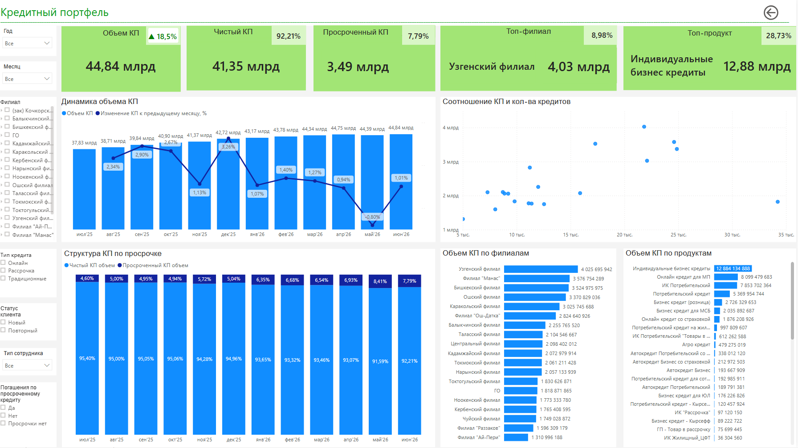
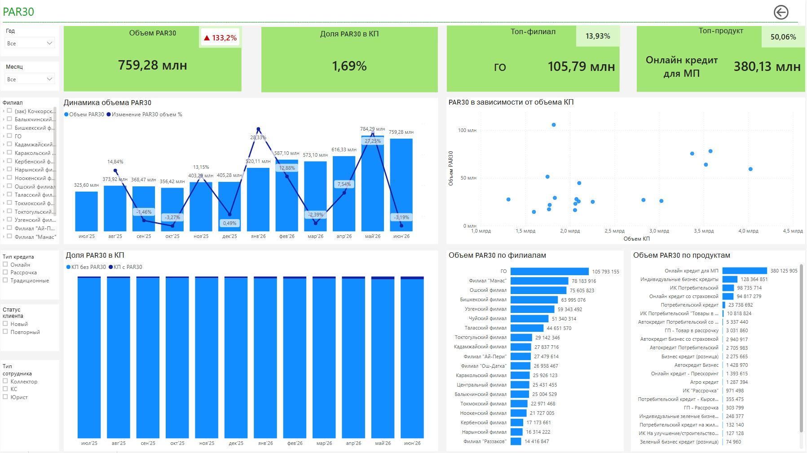
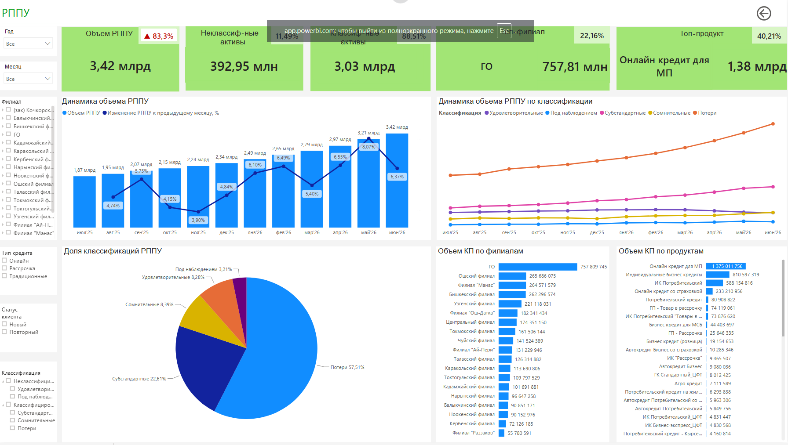
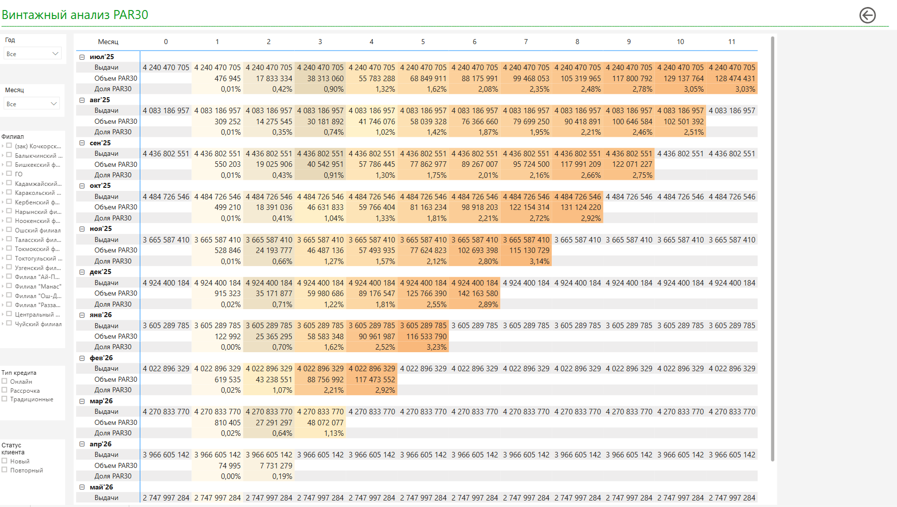
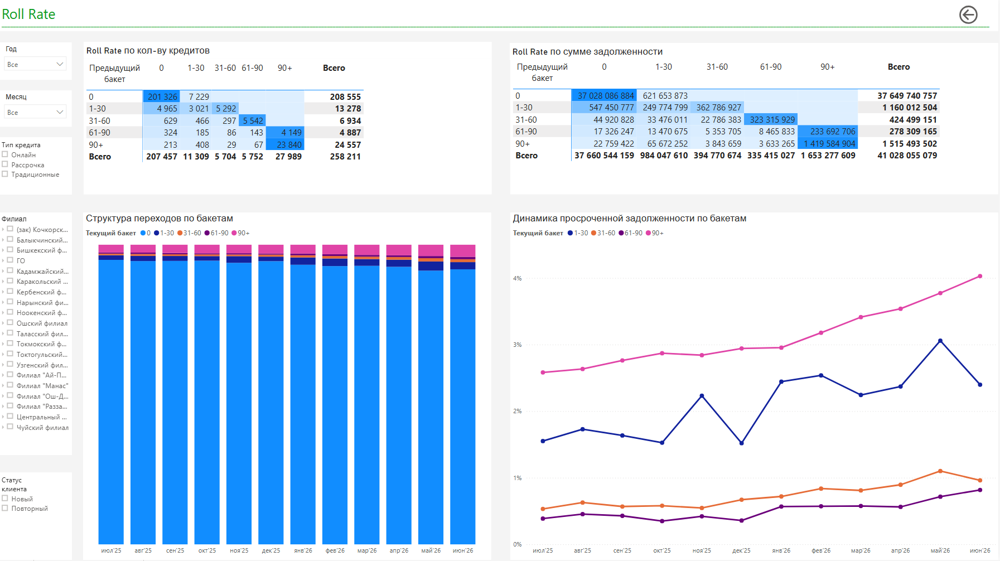

# Анализ качества кредитного портфеля

## О проекте

Проект разработан для анализа качества кредитного портфеля банка и мониторинга ключевых показателей риска.

В проекте реализована подготовка SQL-витрин на базе данных DWH и разработан Power BI дашборд для анализа качества кредитного портфеля, включая выдачи, текущий портфель, PAR, РППУ, FPD, Vintage и Roll Rate.

## Данные

В основе проекта использованы данные кредитного портфеля банка. Для публикации в открытом доступе числовые показатели были изменены и не соответствуют фактическим значениям.

Персональные данные клиентов и сотрудников не используются.

## Используемые инструменты

- PostgreSQL
- SQL
- Power BI
- DAX

## Реализованные аналитические витрины

### Выдачи кредитов
Формирование витрины по выданным кредитам с определением статуса клиента (новый/повторный), суммы и параметров кредита.

### Кредитный портфель
Витрина для анализа текущего состояния кредитного портфеля на выбранную дату с детализацией по остаткам основного долга, процентам, PAR, статусу клиента, филиалам и отделениям.

### РППУ
Анализ резервов по кредитам с детализацией по категориям классификации и основаниям формирования резервов.

### FPD (First Payment Default)
Определение факта возникновения просрочки после первого платежа по графику.

### Винтажный анализ
Когортный анализ качества кредитов по месяцам выдачи с расчетом показателей по возрасту кредита (MOB).

### Roll Rate
Анализ переходов кредитов между стадиями просрочки (бакетами) для оценки динамики кредитного риска.

## Ключевые метрики

- Объем кредитного портфеля
- Количество кредитов
- PAR 1
- PAR 30
- PAR 90
- FPD
- РППУ
- Roll Rate
  
## Power BI

В папке [powerbi](powerbi/) представлены скриншоты основных страниц дашборда.

### Кредитный портфель



### PAR30



### РППУ



### Vintage PAR30



### Roll Rate



## Структура репозитория

```text
sql/       - SQL-скрипты для формирования аналитических витрин
powerbi/   - скриншоты страниц разработанного дашборда Power BI
